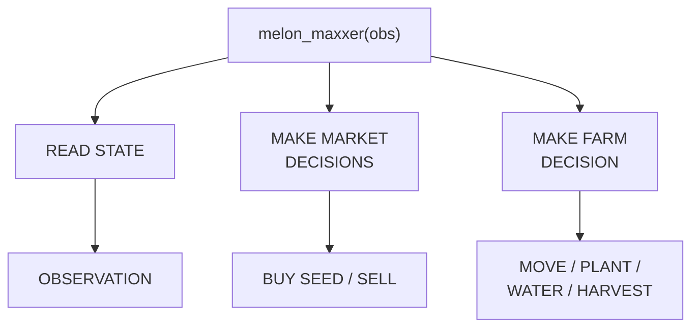
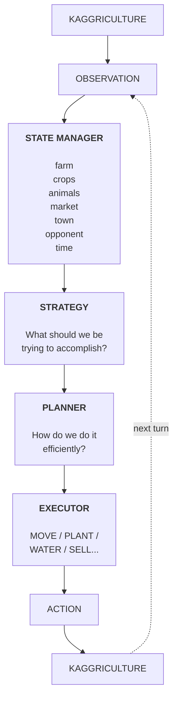
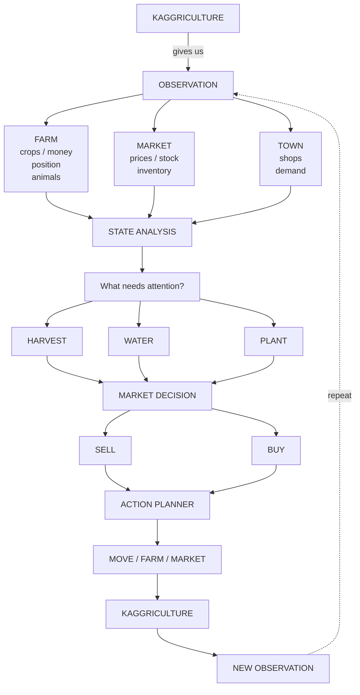
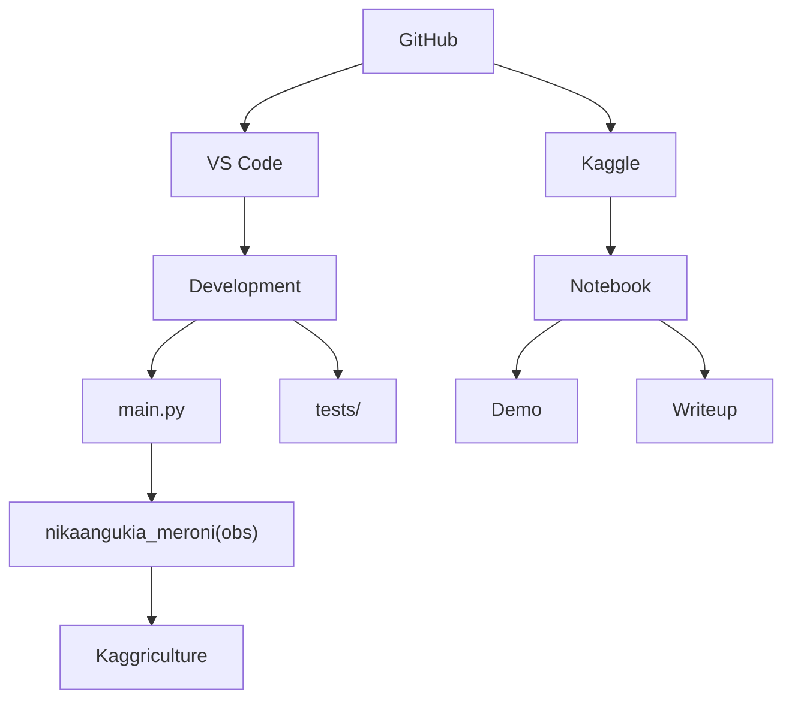
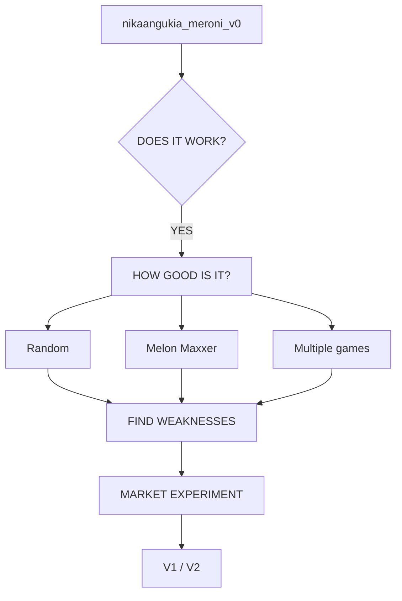

# Kaggriculture Farming Agents

An autonomous agent for [Kaggriculture](https://kaggle.com/competitions/kaggriculture), a Kaggle simulation competition: two agents each run a virtual farm for a 30-day season (720 turns) and compete head-to-head for the highest bank balance.

**New to the repo? Read [CONTRIBUTING.md](CONTRIBUTING.md) first** — how we evaluate a change, what a PR needs, and the list of things here that fail *silently*. `CLAUDE.md` is the deep reference for game mechanics and engine gotchas.

## Team status

> **Before you submit anything to Kaggle, check with the team.** We get **5 submissions/day** and **only the latest 2 stay active** for matchmaking and final scoring — an extra upload silently deactivates work that is still collecting ladder signal.

**Where we stand:** rank ~3,520 of 4,714, rating oscillating in the 450-570 band. The leaderboard median is **744.5**, top-25% is **1,648**, and the leader is **3,221.9**. We are below median and not competitive yet.

> **A single rating reading is not a result.** Every submission is seeded at **600** before it plays anything, then drifts +-120 as episodes accumulate - one measured run went `600 -> 708 -> 572 -> 489 -> 548 -> 472` in 21 minutes on unchanged code. Keep an unchanged control submission in one of the two active slots so you can tell a real gain from the swing. See [CONTRIBUTING.md](CONTRIBUTING.md).

**Local baseline** (`main.py` at `ebc8212`, crop economics + goose, 12 seeded 720-turn seasons):

| vs | mean | wins |
|---|---|---|
| `pass` | 41,969 | 12/12 |
| `random` | 42,812 | 12/12 |
| `starter` | 43,105 | 12/12 |
| **self-play** | **31,132/side** | — |

**Read the self-play number, not the others.** `pass`, `random` and `starter` sell nothing, so they leave every market untouched and flatter us badly — that gap is why a 33,000 local score became 289.3 on the ladder. Self-play is the cheapest honest proxy for a real opponent competing in the same market.

### How to evaluate a change

Never on a single episode — run-to-run spread on an identical agent exceeds 1,400 bank.

```bash
.venv/Scripts/python.exe -m unittest discover -s tests   # 55 tests
.venv/Scripts/python.exe experiments/seeded_batch.py     # mean / stdev / win-rate
```

A/B against `pass` and `starter`: a fixed `seed` makes the environment deterministic but does **not** control the built-in `random` agent's own RNG.

Before any submission, run the self-play gate — Kaggle validates every upload with an agent-vs-itself episode, and a crash there rejects it regardless of strategy:

```bash
.venv/Scripts/python.exe -c "
from kaggle_environments import make
env = make('kaggriculture', configuration={'episodeSteps': 720, 'seed': 0})
env.run(['main.py', 'main.py'])
print([s.status for s in env.steps[-1]])   # must be ['DONE', 'DONE']
"
```

`CLAUDE.md` carries the full engineering detail: measured dead ends (`BUY_LAND` and denser crews both lose money — twice-tested), silent-failure gotchas, and the agent I/O contract.

Full competition rules, game mechanics, pricing formulas, and observation/action schemas are compiled in **[`docs/kaggriculture_context.md`](docs/kaggriculture_context.md)** — read it before changing any game logic. `CLAUDE.md` has the condensed version for AI coding agents working in this repo.

## Agent anatomy

At its simplest, `melon_maxxer(obs)` reads the current state and chooses between market and farm decisions. The market branch buys seed or sells produce; the farm branch moves, plants, waters, or harvests.

Our agent, `nikaangukia_meroni(obs)`, follows the same shape but does more on each branch: the market branch buys seeds and animals, protects the feed reserve, sells produce and hires hands; the farm branch moves, plants, waters, digs weeds, feeds, cares, collects fertilizer, harvests, and places animals.



The complete agent is an observation-to-action control loop. The state manager turns each observation into a useful model of the world. Strategy selects the objective, the planner determines an efficient route to it, and the executor emits one legal game action. Kaggriculture then returns the next observation and the cycle repeats.



The decision pipeline expands the loop into the specific information and choices the agent processes each turn:



## Repository layout

```text
washamba_bots/
├── main.py                  # The agent. This single file IS the submission.
├── tests/                   # 55 stdlib-unittest cases for main.py's helpers
├── experiments/             # Evaluation tooling
│   ├── seeded_batch.py      #   mean / stdev / win-rate vs the built-ins
│   ├── benchmark.py         #   adds melon_maxxer from the official notebook
│   ├── replay_diagnostics.py#   action histogram + end-of-farm state
│   └── market_probe.py
├── notebooks/               # Experiments notebook (charts, diagnostics)
├── docs/                    # Compiled competition reference
├── CLAUDE.md                # Engineering notes: gotchas, dead ends, contracts
└── README.md
```

`main.py` is deliberately a single file — the competition accepts one `main.py` at the repo root, and keeping it self-contained avoids packaging a tarball. There is no `agent/` package; the earlier multi-module layout was never built.

**One entrypoint rule worth knowing before you edit `main.py`:** the framework picks **the last callable in the module namespace**, not a function named `agent`. A helper function or class defined *below* the agent silently becomes the submission — the episode still reports `DONE`, every action is discarded, and the agent finishes on exactly its starting $3,000. The file ends with `agent = nikaangukia_meroni`; keep that line last.

## Project architecture

GitHub is the shared source of truth for both development and the Kaggle-facing
materials. The VS Code branch contains the competition entrypoint and its local
tests. The Kaggle branch contains the notebook used to demonstrate the agent and
explain the approach.



The responsibilities are deliberately separated:

- `main.py` is the Kaggle-compatible competition entrypoint and exposes
  `nikaangukia_meroni(obs)`.
- `tests/` verifies individual decisions and protects the agent from regressions.
- The Kaggle notebook provides a runnable demo and the public methodology writeup.
- Versioned candidates such as `nikaangukia_meroni_v0`, V1, and V2 move through
  the validation workflow below before replacing the active agent.

## Development workflow

```text
GitHub
  ↓
VS Code — write / modify agent
  ↓
Local Kaggriculture — run hundreds of games
  ↓
Inspect results and replays
  ↓
Improve agent
  ↓
Submit to Kaggle
  ↓
Play against real opponents
  ↓
Track the leaderboard
```

The local simulation loop is the main iteration cycle: make a focused change, run many games against varied opponents, inspect outcomes and replays, then keep or revise the strategy before submitting.

## Validation workflow

Each candidate version (e.g. `nikaangukia_meroni_v0`) goes through the same gate before it's trusted: confirm it runs without erroring, then benchmark it to see how good it actually is. Weaknesses found there feed a targeted market experiment, which in turn decides the next version.



## Competition snapshot

| | |
|---|---|
| Prizes | $50,000 — 10 places × $5,000 |
| Entry deadline | Sept 23, 2026 |
| Final submission deadline | Sept 30, 2026 |
| Leaderboard | Live episodes + final Bradley-Terry tournament (no private leaderboard) |
| Winner obligations | Publish methodology writeup, license code CC-BY 4.0 |

## Setup

We use [`uv`](https://docs.astral.sh/uv/) — it manages the interpreter itself, so no `pyenv` needed:

```bash
uv venv --python 3.13.7 .venv
uv pip install --python .venv/Scripts/python.exe \
  "kaggle-environments>=1.32.6" kaggle \
  numpy pandas matplotlib seaborn jupyterlab ipykernel
```

On macOS the interpreter is `.venv/bin/python` instead of `.venv/Scripts/python.exe`. **Don't commit either path** — the team is split across macOS and Windows, and a hardcoded interpreter path silently breaks the other half: VS Code falls back to the system Python and every `import kaggle_environments` fails while the venv sits there working. The Python extension auto-discovers `.venv` on both platforms.

`kaggle-environments>=1.32.6` is not optional. Competition staff shipped a mid-season balance patch (Town Center demand, shop sampling with replacement); anything older simulates different rules. The official starter notebook still pins `>=1.32.2` — don't copy that.

`requirements.txt` is a broad 190-package `pip freeze` from a wider ML workspace, not this agent's dependency set. Installing it wholesale isn't required.

### Notebooks

Select the **`Python 3.13 (washamba_bots)`** kernel. Register it once:

```bash
.venv/Scripts/python.exe -m ipykernel install --user \
  --name washamba-bots --display-name "Python 3.13 (washamba_bots)"
```

A kernelspec whose launch command is the bare word `python` rather than an absolute path will start whatever is first on `PATH` — which is how a notebook ends up on the system Python reporting `No module named kaggle_environments`. For the same reason use `%pip install` in notebooks, never `!pip install`: `%pip` targets the running kernel, `!pip` shells out to `PATH`.

Generate a Kaggle API token at kaggle.com/settings/api and save it to `~/.kaggle/access_token` (or `kaggle auth login`, or set `KAGGLE_API_TOKEN`).

## Local testing

```python
from kaggle_environments import make

env = make("kaggriculture", configuration={"episodeSteps": 720}, debug=True)
env.run([agent, "random"])          # built-in opponents: "pass", "random", "starter"

final = env.steps[-1]
for i, s in enumerate(final):
    print(f"Player {i}: reward={s.reward}, status={s.status}")

env.render(mode="ipython", width=1200, height=800)
```

## Submitting

```bash
# Single-file agent
kaggle competitions submit kaggriculture -f main.py -m "message"

# Multi-file agent (main.py must be at the tar root)
tar -czf submission.tar.gz main.py helper.py model_weights.pkl
kaggle competitions submit kaggriculture -f submission.tar.gz -m "message"

kaggle competitions submissions kaggriculture
kaggle competitions episodes <SUBMISSION_ID>
kaggle competitions leaderboard kaggriculture -s
```

Every submission runs a validation episode (agent vs. itself); if it errors, pull logs with `kaggle competitions logs <EPISODE_ID> 0`.

## Hard constraints

- Agent entrypoint: `main.py` at the root, or a `.tar.gz` with `main.py` at the root. Max **100 MiB**.
- Per-episode compute: 8 GiB HDD, 6.5 GiB RAM, 1.6 vCPUs.
- **No network access during an episode** — the agent only sees `obs`, nothing else.
- Max 5 submissions/day; only your latest 2 stay active for matchmaking and final scoring.
- Private sharing of competition code outside your team is a rules violation.

## License

Winning submissions must be released under CC-BY 4.0 per competition rules. Competition data is Apache 2.0.
