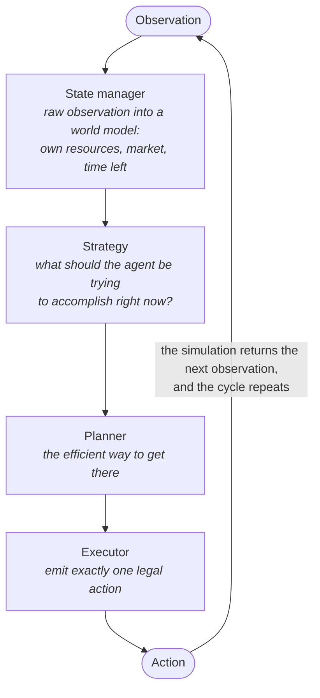

<h1 align="center">Washamba Bots</h1>

<p align="left">
  An autonomous decision-making agent for a two-player, turn-based
  resource-management simulation,<br/>
  built and evaluated with a strict emphasis on proving a change actually helps
  before trusting it.
</p>

<p align="left">
  
  
  
  
  
  
  
</p>

---

## Table of Contents

- [About the Project](#about-the-project)
- [Why This Project](#why-this-project)
  - [Why the project exists](#why-the-project-exists)
  - [Why deterministic first, not learned](#why-deterministic-first-not-learned)
- [Tech Stack](#tech-stack)
- [Features](#features)
- [Getting Started](#getting-started)
  - [Prerequisites](#prerequisites)
  - [Installation](#installation)
  - [Usage](#usage)
- [Environment Variables](#environment-variables)
- [Project Structure](#project-structure)
- [Roadmap](#roadmap)
- [Contributing](#contributing)
- [Team](#team)
- [License](#license)
- [Contact](#contact)
- [Acknowledgments](#acknowledgments)


## About the Project

This project builds an autonomous agent for a two-player, turn-based resource-management simulation. On every turn, both agents observe the same shared world: which are their own holdings, a live trading market both sides affect, and a fixed amount of time remaining; and each independently commits to one action. The match runs for a fixed number of turns and whichever agent ends with the higher balance wins.

The agent operates under two hard constraints that shape almost every design decision in this repository:

- **A strict, per-decision time budget.** The agent has a small fraction of a second to choose each action, which rules out expensive search or lookahead since every decision has to come from a fast, precomputed rule, not from exploring the future live.
- **No network access once a match starts.** Whatever the agent needs to know about the world has to already be built into the code before the match begins; it cannot look anything up mid-match.

There is no static training or test dataset for this problem. The only way to know whether a change actually helps is to run real matches: locally, against a set of reference opponents and earlier versions of the agent itself, or in live scored matches on the hosting platform, and compare the outcomes properly. In practice, more of the engineering effort here has gone into making that comparison trustworthy than into the agent's decision logic itself; see [Why This Project](#why-this-project) below.

## Why This Project

Two things are worth explaining separately: why this problem is worth building an agent for, and why the team specifically chose to build a **deterministic, rule-based** agent before considering a **learned** one.

### Why the project exists

The simulation this project targets has no fixed, correct answer to memorize. Scoring is entirely relative: determined by how one agent's decisions play out against another's, turn by turn, in a shared world with a live market both agents affect. That makes it a genuinely interesting decision problem: what to produce, when to trade, when to expand, when to bring on more help all trade off against each other, under a time budget too tight for the agent to search its way out of a bad choice in the moment.

### Why deterministic first, not learned

It's worth being plain about what the two approaches actually mean, since the terms get used loosely:

- A **deterministic (rule-based) agent** follows a fixed, human-written decision procedure. Given the same situation twice, it makes the same choice twice, and every decision traces back to an explicit rule in the code; if the agent does something wrong, you can point at the exact line responsible.

- A **learned agent** is instead trained on data or simulated experience to discover its own decision procedure: a large set of numerical weights, adjusted automatically until its behaviour scores well. It can pick up patterns a human author wouldn't think to hand-write, but in exchange for losing that line-by-line traceability; when it underperforms, the honest first answer is often "retrain and see," not "here is the specific rule to fix."

The team built the deterministic agent first, and the reason has less to do with the agent itself than with what building it forces you to get right first: **a trustworthy way of measuring whether a change actually worked.**

This project's internal engineering notes are blunt about why that had to come first: almost everything that goes wrong in a system like this goes wrong *silently* — no exception, no failing test, no error in a log; and a single run of the simulation is not evidence of anything, because run-to-run variance is large enough to make a real improvement and pure noise look identical. We were burned by exactly this: we had a genuine improvement that was once misread as "no effect" because it was measured against the wrong baseline, and a lucky single run was once mistaken for a stable result. We had to build disciplined fixes, paired evaluation methodology - put both versions through the same conditions and compare the *difference* between them, not their raw scores in isolation — together with a frozen-checkpoint system, so a new idea is always measured against a fixed, known-good baseline rather than against whatever happens to be the latest code that day.

Evaluation discipline is the prerequisite for the "real" agent work, and it matters even more once a learned agent enters the picture later. A rule-based agent's mistakes are visible directly in its code; you can read exactly why it did something. A learned agent's mistakes are visible only in its behaviour, and the only way to tell a real improvement from noise, or a genuine regression from bad luck, is the same measurement discipline this project built first. Getting that process right against a system you can fully audit — before ever pointing it at a system you can't — is the actual point of the deterministic phase.

## Tech Stack

Python 3.12 throughout. The shipped agent's decision logic depends only on the Python standard library and the competition's simulation engine (named in [CONTRIBUTING.md](CONTRIBUTING.md)), so the agent is a single self-contained file with no heavy runtime dependencies and nothing to look up mid-match. The analysis and evaluation side uses **pandas**, **NumPy**, **SciPy**, **Matplotlib** and **Seaborn** inside **Jupyter** notebooks for exploring and visualizing match results, and Python's built-in **unittest** for the agent's unit tests.

## Features

Since this is a single autonomous agent rather than a service with a frontend and backend, "features" means the real technical capabilities this repository provides:

- **A four-stage decision pipeline** — state manager → strategy → planner → executor — that turns each raw observation into exactly one legal action every turn. See [Project Structure](#project-structure) for the diagram.
- **A layered evaluation harness**, purpose-built because single-run scores are not trustworthy here: paired comparison (same conditions, two versions, compare the difference), self-play (the agent against itself, the number that best predicts a live match), and seeded batch runs against a set of reference opponents.
- **A round-robin ranking harness** that plays any set of candidate agents against each other, both seats, over many seeds, and ranks them by a match-accurate score (win, loss, or tie, margin ignored) so a candidate is judged locally before it ever costs a live submission.
- **A frozen-checkpoint system**, so a new idea is always measured against a fixed, known-good baseline rather than against whatever is currently on the main branch.
- **A documented negative-results log** — strategies that were tried, measured, and rejected are written down alongside *why*, so the same dead end isn't re-explored by intuition months later.
- **A unit test suite** covering the agent's decision logic in isolation, independent of running a full match.
- **A single-file, deployable agent** — the entire decision logic ships as one self-contained file with no external service dependencies at run time.

## Getting Started

### Prerequisites

- Python 3.12 (pinned in `.python-version`)
- [`uv`](https://docs.astral.sh/uv/) for environment and dependency management — it also provisions the Python interpreter itself, so a separate Python install isn't required

### Installation

```bash
git clone https://github.com/Kinjuriu/washamba_bots.git
cd washamba_bots

# Creates an isolated environment and provisions the interpreter
uv venv --python 3.12 .venv

# Installs the numerical and analysis dependencies
uv pip install --python .venv/bin/python \
  numpy pandas matplotlib seaborn scipy jupyterlab ipykernel
```

Running the agent locally also requires the third-party simulation package used to execute matches. Its exact name, pinned version, and one-time account setup are covered in [CONTRIBUTING.md](CONTRIBUTING.md) rather than repeated here; the version matters, since the simulation's rules have changed mid-project and an older version silently simulates different rules.

*(On Windows, the interpreter path is `.venv\Scripts\python.exe` instead of `.venv/bin/python`.)*

### Usage

```bash
# Run the test suite
.venv/bin/python -m unittest discover -s tests

# A/B two versions of the agent over the same fixed set of match seeds
.venv/bin/python experiments/paired_compare.py path/to/baseline.py path/to/variant.py

# Play two agent files directly against each other, needed for anything
# that changes when or how much the agent trades, since single-sided
# comparisons can't see a contested market at all
.venv/bin/python experiments/head_to_head.py variant.py baseline.py

# Round-robin rank a set of candidate agents against each other, both seats,
# scored the way live matches are (win / loss / tie, margin ignored)
.venv/bin/python experiments/rank_bases.py 12 agents/baseline.py candidate.py

# The agent against itself, over several match seeds, the single local
# number that best predicts how a change performs in a live match
.venv/bin/python experiments/selfplay_bench.py
```

A full match runs in a few seconds locally, so running hundreds of them for a proper comparison is a matter of minutes, not hours.

## Environment Variables

There is no `.env` file, and no secrets are stored anywhere in this repository. The only external setup step is a one-time, interactive command-line authentication with the platform that hosts the simulation environment and scores live matches, generated once from that platform's own account settings page. After that one-time step, no environment variables or further configuration are needed to run the agent or its tests locally.

## Project Structure

```text
washamba_bots/
├── main.py              # The deterministic agent — a single file, deployable as-is
├── pricing.py           # A standalone pricing model (research; not wired into the agent)
├── agents/              # Reference and candidate agents used as sparring opponents
├── tests/               # Unit tests for the agent's decision logic, run in isolation
├── experiments/         # Evaluation tooling: paired comparison, self-play,
│                        #   round-robin ranking (rank_bases.py), reference-agent
│                        #   reconstruction (decode_route.py), seeded batches, diagnostics
├── notebooks/           # Exploratory analysis and result visualization
├── docs/                # Architecture notes, frozen checkpoints, and internal reference material
├── CLAUDE.md            # Internal engineering notes: gotchas, decisions, and documented dead ends
├── CONTRIBUTING.md      # How the team works, and the evaluation standard every change is held to
├── ROADMAP.md           # Where the project has been and where it's headed
└── LICENSE
```

### Decision pipeline



## Roadmap

- [x] **Deterministic agent** — a fully rule-based agent, plus the evaluation harness (paired comparison, self-play, round-robin ranking, frozen checkpoints, a documented negative-results log) needed to trust any claim made about it.
- [ ] **Forward-pricing model** — a more accurate model of how trading a given quantity moves the market price, developed and validated as a standalone module before it's wired into the agent's live decisions.
- [ ] **Learned agent** — a model trained on experience rather than hand-written rules, once the measurement process built above can be trusted to evaluate it fairly.

See open items and known gaps in [GitHub Issues](https://github.com/Kinjuriu/washamba_bots/issues).

## Contributing

This is currently a closed, private team project and isn't open to outside contributions. Team members: see [CONTRIBUTING.md](CONTRIBUTING.md) for how we work and the evaluation standard every change is held to.

## Team

<a href="https://github.com/Kinjuriu/washamba_bots/graphs/contributors">
  
</a>

## License

This repository's code is licensed under **CC BY 4.0** — see [LICENSE](LICENSE) for the full text. Some reference agents in `agents/` are reconstructed from third-party sources under their own upstream licenses (Apache 2.0), each credited in its own file header; those licenses cover that agent's code, not this repository. The third-party simulation environment and its game data are licensed separately by their own maintainers and are not covered by this repository's license.

## Contact

Questions or issues? Open a [GitHub issue](https://github.com/Kinjuriu/washamba_bots/issues), or reach the repository owner, [@Kinjuriu](https://github.com/Kinjuriu).

## Acknowledgments

(to be added)
