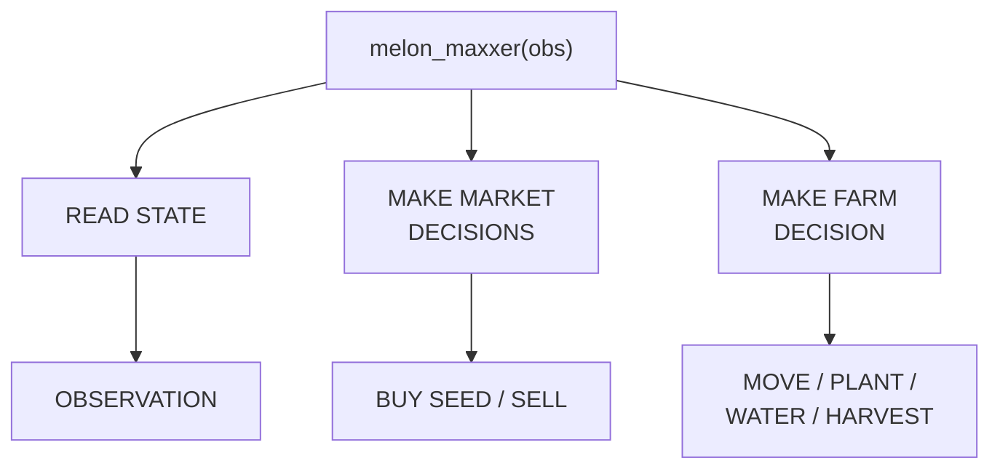
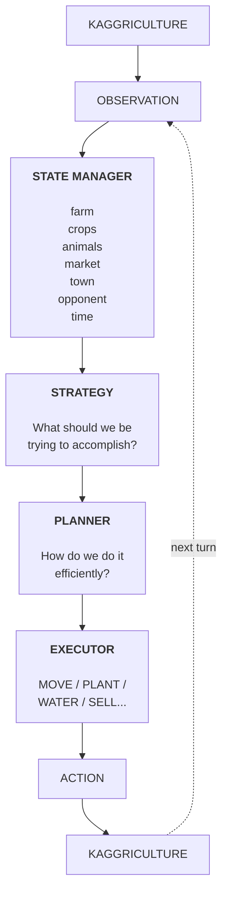
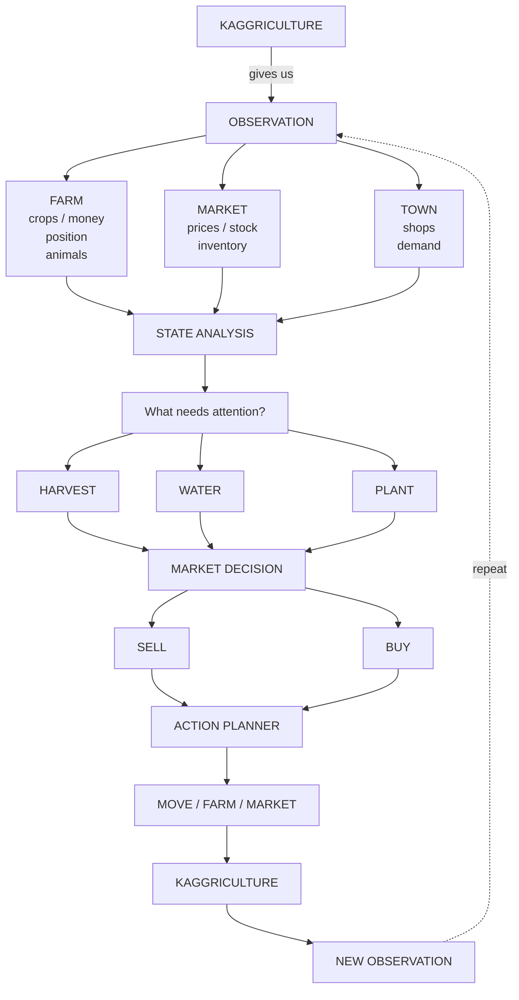

# Kaggriculture Farming Agents

An autonomous agent for [Kaggriculture](https://kaggle.com/competitions/kaggriculture), a Kaggle simulation competition: two agents each run a virtual farm for a 30-day season (720 turns) and compete head-to-head for the highest bank balance.

Full competition rules, game mechanics, pricing formulas, and observation/action schemas are compiled in **[`docs/kaggriculture_context.md`](docs/kaggriculture_context.md)** — read it before changing any game logic. `CLAUDE.md` has the condensed version for AI coding agents working in this repo.

## Agent anatomy

At its simplest, `melon_maxxer(obs)` reads the current state and chooses between market and farm decisions. The market branch buys seed or sells produce; the farm branch moves, plants, waters, or harvests.



The complete agent is an observation-to-action control loop. The state manager turns each observation into a useful model of the world. Strategy selects the objective, the planner determines an efficient route to it, and the executor emits one legal game action. Kaggriculture then returns the next observation and the cycle repeats.



The decision pipeline expands the loop into the specific information and choices the agent processes each turn:



## Repository layout

```text
washamba_bots/
├── main.py                 # Actual competition agent entrypoint
├── agent/
│   ├── __init__.py
│   ├── state.py
│   ├── strategy.py
│   ├── economy.py
│   ├── movement.py
│   └── planner.py
├── experiments/             # Baselines and experiments
├── notebooks/               # Exploration notebooks
├── tests/
├── README.md
└── requirements.txt
```

## Development workflow

```text
GitHub
  ↓
VS Code — write / modify agent
  ↓
Local Kaggriculture — run hundreds of games
  ↓
Inspect results and replays
  ↓
Improve agent
  ↓
Submit to Kaggle
  ↓
Play against real opponents
  ↓
Track the leaderboard
```

The local simulation loop is the main iteration cycle: make a focused change, run many games against varied opponents, inspect outcomes and replays, then keep or revise the strategy before submitting.

## Competition snapshot

| | |
|---|---|
| Prizes | $50,000 — 10 places × $5,000 |
| Entry deadline | Sept 23, 2026 |
| Final submission deadline | Sept 30, 2026 |
| Leaderboard | Live episodes + final Bradley-Terry tournament (no private leaderboard) |
| Winner obligations | Publish methodology writeup, license code CC-BY 4.0 |

## Setup

```bash
pyenv install --skip-existing 3.12.3
pyenv exec python -m venv .venv
source .venv/bin/activate
python -m pip install --upgrade pip setuptools wheel
python -m pip install -r requirements.txt
```

The repository's `.python-version` selects Python 3.12.3 when pyenv is active. In VS Code, select `.venv/bin/python` as the Python interpreter and notebook kernel.

Generate a Kaggle API token at kaggle.com/settings/api and save it to `~/.kaggle/access_token` (or `kaggle auth login`, or set `KAGGLE_API_TOKEN`).

## Local testing

```python
from kaggle_environments import make

env = make("kaggriculture", configuration={"episodeSteps": 720}, debug=True)
env.run([agent, "random"])          # built-in opponents: "pass", "random", "starter"

final = env.steps[-1]
for i, s in enumerate(final):
    print(f"Player {i}: reward={s.reward}, status={s.status}")

env.render(mode="ipython", width=1200, height=800)
```

## Submitting

```bash
# Single-file agent
kaggle competitions submit kaggriculture -f main.py -m "message"

# Multi-file agent (main.py must be at the tar root)
tar -czf submission.tar.gz main.py helper.py model_weights.pkl
kaggle competitions submit kaggriculture -f submission.tar.gz -m "message"

kaggle competitions submissions kaggriculture
kaggle competitions episodes <SUBMISSION_ID>
kaggle competitions leaderboard kaggriculture -s
```

Every submission runs a validation episode (agent vs. itself); if it errors, pull logs with `kaggle competitions logs <EPISODE_ID> 0`.

## Hard constraints

- Agent entrypoint: `main.py` at the root, or a `.tar.gz` with `main.py` at the root. Max **100 MiB**.
- Per-episode compute: 8 GiB HDD, 6.5 GiB RAM, 1.6 vCPUs.
- **No network access during an episode** — the agent only sees `obs`, nothing else.
- Max 5 submissions/day; only your latest 2 stay active for matchmaking and final scoring.
- Private sharing of competition code outside your team is a rules violation.

## License

Winning submissions must be released under CC-BY 4.0 per competition rules. Competition data is Apache 2.0.
