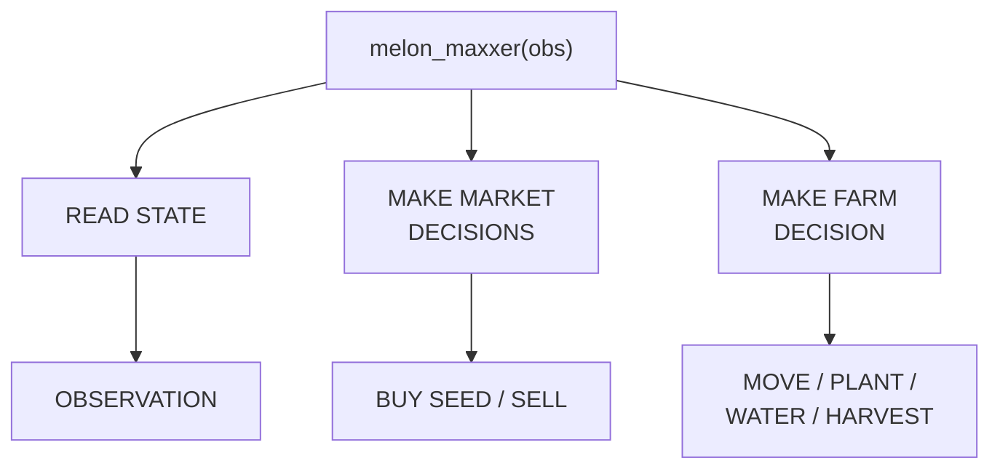
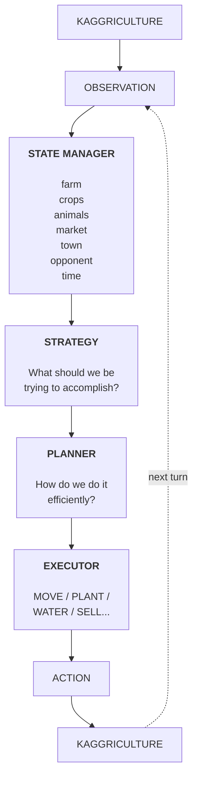
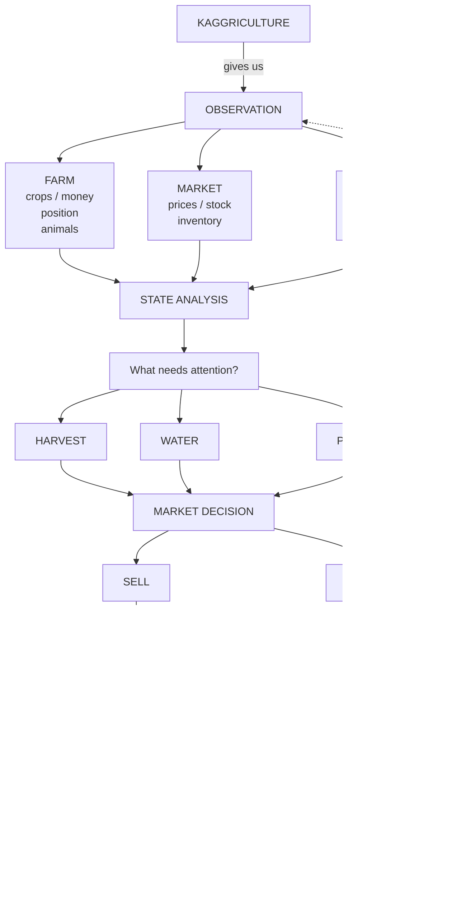
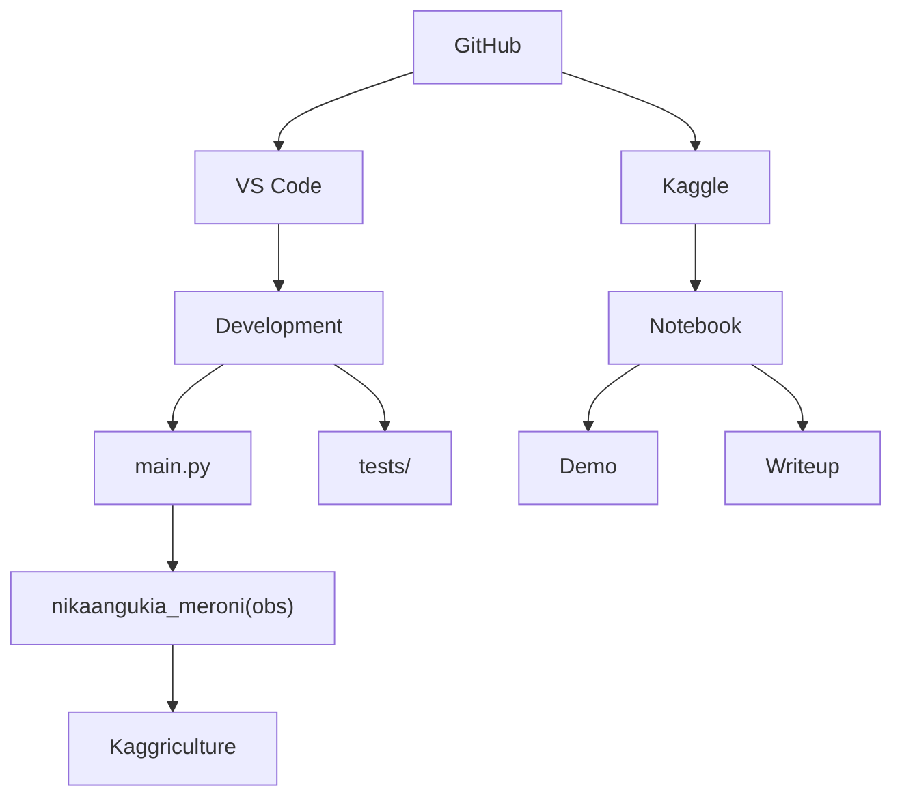

# Architecture

How the agent is put together, and how the repo's pieces relate. This lived in
`README.md` and moved here to keep that file a landing page — see
[CHECKPOINTS.md](CHECKPOINTS.md) for how changes to any of it get evaluated.

## Agent anatomy

At its simplest, `melon_maxxer(obs)` reads the current state and chooses between market and farm decisions. The market branch buys seed or sells produce; the farm branch moves, plants, waters, or harvests.

Our agent, `nikaangukia_meroni(obs)`, follows the same shape but does more on each branch: the market branch buys seeds and animals, protects the feed reserve, sells produce and hires hands; the farm branch moves, plants, waters, digs weeds, feeds, cares, collects fertilizer, harvests, and places animals.



The complete agent is an observation-to-action control loop. The state manager turns each observation into a useful model of the world. Strategy selects the objective, the planner determines an efficient route to it, and the executor emits one legal game action. Kaggriculture then returns the next observation and the cycle repeats.



The decision pipeline expands the loop into the specific information and choices the agent processes each turn:



## Repository layout

```text
washamba_bots/
├── main.py                  # The agent. This single file IS the submission.
├── tests/                   # 55 stdlib-unittest cases for main.py's helpers
├── experiments/             # Evaluation tooling
│   ├── seeded_batch.py      #   mean / stdev / win-rate vs the built-ins
│   ├── benchmark.py         #   adds melon_maxxer from the official notebook
│   ├── replay_diagnostics.py#   action histogram + end-of-farm state
│   └── market_probe.py
├── notebooks/               # Experiments notebook (charts, diagnostics)
├── docs/                    # Compiled competition reference
├── CLAUDE.md                # Engineering notes: gotchas, dead ends, contracts
└── README.md
```

`main.py` is deliberately a single file — the competition accepts one `main.py` at the repo root, and keeping it self-contained avoids packaging a tarball. There is no `agent/` package; the earlier multi-module layout was never built.

**One entrypoint rule worth knowing before you edit `main.py`:** the framework picks **the last callable in the module namespace**, not a function named `agent`. A helper function or class defined *below* the agent silently becomes the submission — the episode still reports `DONE`, every action is discarded, and the agent finishes on exactly its starting $3,000. The file ends with `agent = nikaangukia_meroni`; keep that line last.

## Project architecture

GitHub is the shared source of truth for both development and the Kaggle-facing
materials. The VS Code branch contains the competition entrypoint and its local
tests. The Kaggle branch contains the notebook used to demonstrate the agent and
explain the approach.



The responsibilities are deliberately separated:

- `main.py` is the Kaggle-compatible competition entrypoint and exposes
  `nikaangukia_meroni(obs)`.
- `tests/` verifies individual decisions and protects the agent from regressions.
- The Kaggle notebook provides a runnable demo and the public methodology writeup.
- Versioned candidates such as `nikaangukia_meroni_v0`, V1, and V2 move through
  the validation workflow below before replacing the active agent.
